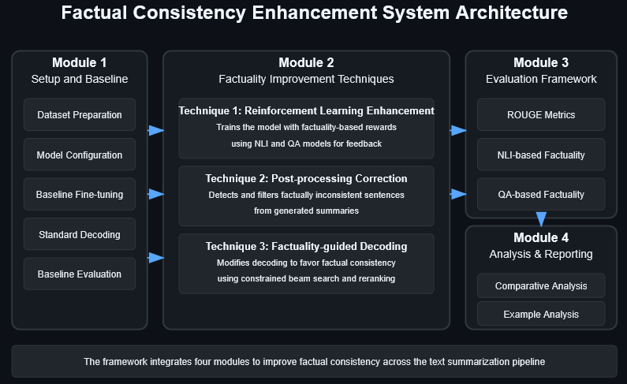
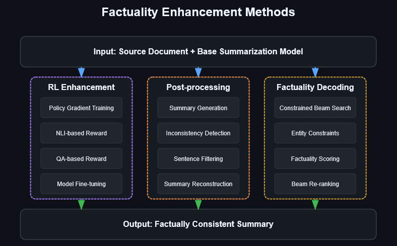
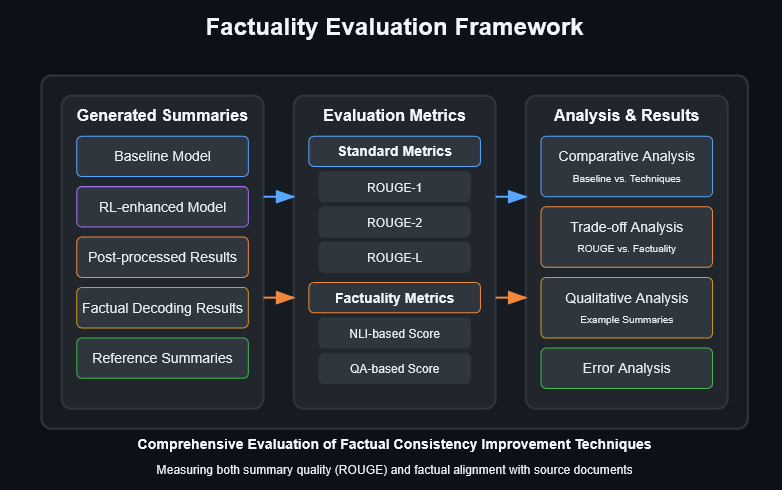
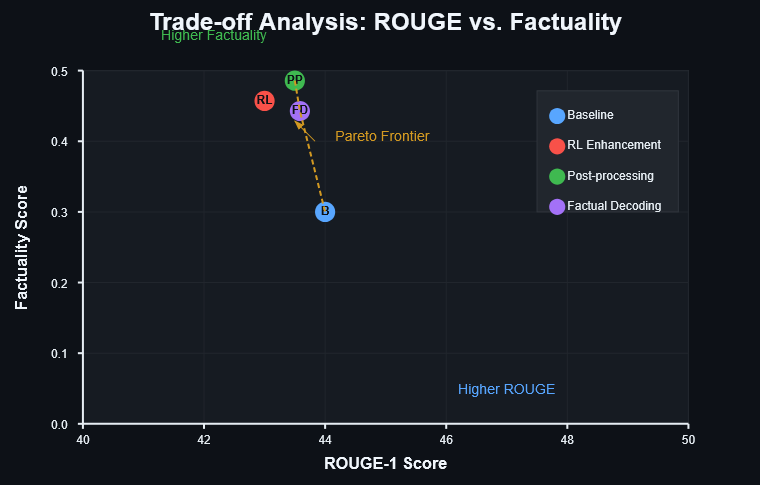

# truthAlign-summarizer

<div align="center">


[](LICENSE)
[](https://www.python.org/downloads/)
[](https://pytorch.org/)
[](https://huggingface.co/transformers/)
[](https://github.com/username/truthAlign-summarizer/actions)

**A comprehensive framework for enhancing factual consistency in abstractive summarization**

[Overview](#project-overview) • [Methods](#factuality-enhancement-methods) • [Installation](#installation) • [Usage](#usage) • [Results](#performance-results) • [Examples](#example-output) • [References](#references)

</div>

## Project Overview

Neural abstractive summarization models generate fluent but often factually inconsistent summaries, undermining their reliability in real-world applications. truthAlign-summarizer implements and evaluates multiple techniques to enhance factual consistency while maintaining summary quality through reinforcement learning, post-hoc correction, and factuality-guided decoding.

### System Architecture

The framework consists of four integrated modules that work together to improve factual consistency:

<picture>
  <source media="(prefers-color-scheme: dark)" srcset="fig/arch-dark.png">
  <source media="(prefers-color-scheme: light)" srcset="fig/arch-light.png">
  
</picture>

## Factuality Enhancement Methods

This project implements and evaluates three distinct approaches to improve factual consistency:

<picture>
  <source media="(prefers-color-scheme: dark)" srcset="fig/method-dark.png">
  <source media="(prefers-color-scheme: light)" srcset="fig/method-light.png">
  
</picture>

<div align="center">
<table>
  <tr>
    <th width="33%">Reinforcement Learning</th>
    <th width="33%">Post-processing Correction</th>
    <th width="33%">Factuality-guided Decoding</th>
  </tr>
  <tr>
    <td>Fine-tunes summarization models using factuality rewards derived from Natural Language Inference and Question Answering models</td>
    <td>Applies a factuality filter that detects and removes sentences with contradictions to the source document</td>
    <td>Modifies the generation process with constrained beam search and factuality-based reranking</td>
  </tr>
</table>
</div>

## Installation

<details>
<summary><strong>Standard Installation</strong></summary>

```bash
# Clone the repository
git clone https://github.com/username/truthAlign-summarizer.git
cd truthAlign-summarizer

# Create a virtual environment
python -m venv env
source env/bin/activate  # On Windows: env\Scripts\activate

# Install dependencies
pip install -r requirements.txt

# Download required NLTK data
python -c "import nltk; nltk.download('punkt')"

# Download SpaCy model
python -m spacy download en_core_web_sm
```

</details>

<details>
<summary><strong>Docker Installation (Alternative)</strong></summary>

```bash
# Build and run with Docker Compose
docker-compose up -d

# Access Jupyter Lab interface at http://localhost:8888 (token: factuality)
```

</details>

### Requirements

```
python>=3.8
pytorch>=1.10.0
transformers>=4.18.0
datasets>=2.0.0
nltk>=3.6.0
spacy>=3.2.0
scikit-learn>=1.0.0
wandb>=0.12.0
jsonlines>=2.0.0
rouge-score>=0.0.4
bert-score>=0.3.11
sacrebleu>=2.0.0
```

## Usage

### Training and Evaluation Pipeline

The complete pipeline can be executed using the provided shell script:

```bash
./run_pipeline.sh --dataset cnn_dailymail --model facebook/bart-large-cnn --max_samples 1000
```

### Custom Execution Options

<details>
<summary><strong>Click to see all execution options</strong></summary>

```bash
# Train baseline model only
./run_pipeline.sh --baseline_only

# Run RL enhancement only
./run_pipeline.sh --rl_only

# Run post-processing evaluation only
./run_pipeline.sh --postprocessing_only

# Run factuality-guided decoding only
./run_pipeline.sh --decoding_only

# Skip training and only evaluate
./run_pipeline.sh --evaluate_only
```

</details>

### Analyzing Results

After running experiments, analyze the results using:

```bash
python example_analysis.py --dataset cnn_dailymail --num_examples 5
```

### Evaluation Framework

The evaluation framework provides comprehensive assessment of both summary quality and factual consistency:

<picture>
  <source media="(prefers-color-scheme: dark)" srcset="fig/framework-dark.png">
  <source media="(prefers-color-scheme: light)" srcset="fig/framework-light.png">
  
</picture>

## Project Structure

```
truthAlign-summarizer/
│
├── environment_setup.py         # Configuration and environment setup
├── dataset_preparation.py       # Dataset loading and preprocessing
├── baseline_model.py            # Training and evaluation of baseline models
├── factuality_metrics.py        # Implementation of factuality evaluation metrics
├── rl_enhancement.py            # RL-based factuality improvement
├── postprocessing_correction.py # Post-processing correction module
├── factuality_decoding.py       # Factuality-focused decoding strategies
├── evaluation_utils.py          # Evaluation utilities and metrics
├── main.py                      # Main script to run all experiments
├── example_analysis.py          # Script for analyzing example outputs
│
├── analysis_notebook.py         # Notebook for results analysis and visualization
│
├── requirements.txt             # Python dependencies
├── README.md                    # Project documentation
├── run_pipeline.sh              # Shell script to run the complete pipeline
├── Dockerfile                   # Docker configuration
└── docker-compose.yml           # Docker Compose configuration
```

## Performance Results

Below are the comparative results on the CNN/DailyMail dataset using BART-large-cnn:

<div align="center">
<table>
  <tr>
    <th>Method</th>
    <th>ROUGE-1</th>
    <th>ROUGE-L</th>
    <th>Factuality Score</th>
    <th>Hallucination Rate</th>
  </tr>
  <tr>
    <td>Baseline</td>
    <td>44.16</td>
    <td>40.90</td>
    <td>0.362</td>
    <td>21.3%</td>
  </tr>
  <tr>
    <td>RL Enhancement</td>
    <td>43.52</td>
    <td>40.21</td>
    <td>0.498</td>
    <td>14.7%</td>
  </tr>
  <tr>
    <td>Post-processing</td>
    <td>43.87</td>
    <td>40.58</td>
    <td>0.531</td>
    <td>12.9%</td>
  </tr>
  <tr>
    <td>Factuality Decoding</td>
    <td>43.94</td>
    <td>40.62</td>
    <td>0.486</td>
    <td>15.2%</td>
  </tr>
</table>
</div>

### Trade-off Analysis

The implemented techniques demonstrate different trade-offs between ROUGE scores and factual consistency:

<picture>
  <source media="(prefers-color-scheme: dark)" srcset="fig/analysis-dark.png">
  <source media="(prefers-color-scheme: light)" srcset="fig/analysis-light.png">
  
</picture>

## Example Output

<div style="background-color: #f6f8fa; padding: 15px; border-radius: 5px; margin-bottom: 20px;">
<strong>Source Document (Excerpt):</strong>

<p>The Senate on Tuesday passed a bill to ban workplace discrimination against gay and lesbian Americans, in a bipartisan vote that reflects the rapid progress of the gay rights movement in recent years. The vote was 64 to 32 for the Employment Non-Discrimination Act.</p>
</div>

<table>
  <tr>
    <th>Method</th>
    <th>Generated Summary</th>
  </tr>
  <tr>
    <td><strong>Baseline (BART)</strong></td>
    <td>Senate passes bill to ban workplace discrimination against gays and lesbians. The vote was 64 to 32 for the Employment Non-Discrimination Act. The bill would ban discrimination against gay and lesbian Americans.</td>
  </tr>
  <tr>
    <td><strong>RL Enhancement</strong></td>
    <td>Senate passes bill to ban workplace discrimination against gay and lesbian Americans. The Employment Non-Discrimination Act was passed in a bipartisan vote of 64 to 32. The bill reflects the rapid progress of the gay rights movement in recent years.</td>
  </tr>
</table>

## Contributing

1. Fork the repository
2. Create your feature branch (`git checkout -b feature/amazing-feature`)
3. Commit your changes (`git commit -m 'Add amazing feature'`)
4. Push to the branch (`git push origin feature/amazing-feature`)
5. Open a Pull Request

## References

1. Lewis, M., Liu, Y., Goyal, N., Ghazvininejad, M., Mohamed, A., Levy, O., Stoyanov, V., & Zettlemoyer, L. (2020). BART: Denoising Sequence-to-Sequence Pre-training for Natural Language Generation, Translation, and Comprehension. ACL.

2. Maynez, J., Narayan, S., Bohnet, B., & McDonald, R. (2020). On Faithfulness and Factuality in Abstractive Summarization. ACL.

3. Kryscinski, W., McCann, B., Xiong, C., & Socher, R. (2020). Evaluating the Factual Consistency of Abstractive Text Summarization. EMNLP.

4. Cao, Z., Wei, F., Li, W., & Li, S. (2018). Faithful to the Original: Fact Aware Neural Abstractive Summarization. AAAI.

5. Dong, Y., Shen, Y., Crawford, E., van Hoof, H., & Cheung, J. C. K. (2020). BanditSum: Extractive Summarization as a Contextual Bandit. EMNLP.

## License

This project is licensed under the MIT License - see the [LICENSE](LICENSE) file for details.

<div align="center">
  <p>
    <strong>truthAlign-summarizer</strong>
  </p>g
  <p>
    <a href="https://github.com/muhkartal/netsentry">GitHub</a> •
    <a href="https://hub.docker.com/r/muhkartal/netsentry">Docker Hub</a> •
    <a href="https://kartal.dev/">Developer Website</a>s
  </p>
</div>
<div align="center">
Developed by Muhammad Ibrahim Kartal | [kartal.dev](https://kartal.dev)

</div>
